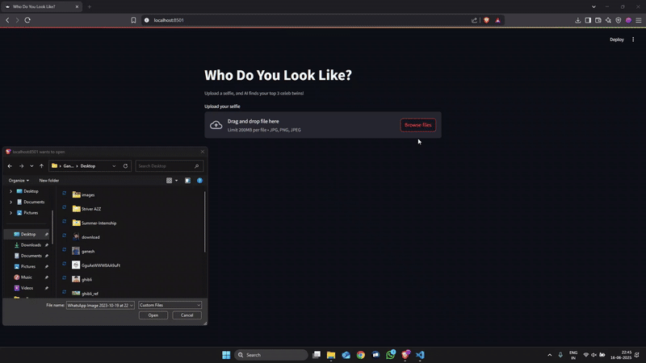

# Celebrity Look-Alike

A web application that uses facial recognition to find your celebrity doppelgänger! Upload a photo, and the app compares your facial features to a dataset of celebrity images to identify your closest match. Built with Python, Streamlit, and advanced machine learning models, this project offers a fun and interactive way to discover which celebrity you resemble.

## Features
- **Image Upload**: Easily upload a photo (jpg, jpeg, png, or gif format) to find your celebrity look-alike.
- **Facial Recognition**: Utilizes MTCNN for face detection and FaceNet for facial feature extraction to ensure accurate comparisons.
- **Real-Time Results**: Displays the closest celebrity match alongside your uploaded image with a similarity score.
- **User-Friendly Interface**: Built with Streamlit for a seamless and intuitive experience.
- **Privacy-Focused**: Images are processed locally and not stored after analysis.

## How It Works
1. **Face Detection**: The app uses MTCNN to detect faces in the uploaded image, ensuring only single-face images are processed for accuracy.
2. **Feature Extraction**: FaceNet extracts a 128-dimensional vector representing the facial features of the detected face.
3. **Similarity Matching**: The extracted vector is compared to a precomputed dataset of celebrity face embeddings using cosine similarity to find the closest match.
4. **Result Display**: The app shows your uploaded image side-by-side with the matched celebrity's image and a similarity score.

## Demo
Below are examples of the app in action:

### Example 1: User Photo and Celebrity Match

*Uploaded photo (left) matched with a celebrity (right) with a similarity score of 0.85.*


## Installation
To run the Celebrity Look-Alike app locally, follow these steps:

### Prerequisites
- Python 3.8 or higher
- pip package manager
- Git

### Steps
1. **Clone the Repository**:
   ```bash
   git clone https://github.com/mc095/Celebrity-Look-Alike.git
   cd Celebrity-Look-Alike
   ```

2. **Create a Virtual Environment**:
   ```bash
   python -m venv venv
   source venv/bin/activate  # On Windows: venv\Scripts\activate
   ```

3. **Install Dependencies**:
   ```bash
   pip install -r requirements.txt
   ```

5. **Run the App**:
   ```bash
   streamlit run app.py
   ```
   Open your browser and navigate to `http://localhost:8501` to use the app.

## Project Structure
- `app.py`: Main Streamlit application script.
- `celeb_images/`: Directory for storing celebrity image dataset.
- `demo/`: Contains demo images for README.
- `requirements.txt`: List of Python dependencies.

## Dependencies
- `streamlit`: For the web interface.
- `facenet-pytorch`: For face detection and feature extraction.
- `opencv-python`: For image processing.
- `numpy`, `pandas`: For data handling and similarity calculations.
- `matplotlib`: For visualizing results.

## Dataset
The app uses a dataset of celebrity images (e.g., from IMDB or Wikipedia). Ensure the dataset is formatted as follows:
- A folder containing subfolders for each celebrity, with images named appropriately.
- A `.csv` or `.pkl` file with precomputed face embeddings for faster matching (generated using `scraper.py` or similar).

## Usage
1. Open the app in your browser.
2. Upload a clear photo of your face (ensure only one face is visible, no hats or obstructions).
3. Click "Find My Celebrity Look-Alike" to process the image.
4. View the result, which includes your photo, the matched celebrity's photo, and the similarity score.

## Limitations
- **Single Face Requirement**: The app works best with images containing only one face. Group photos may lead to inaccurate results.
- **Image Quality**: Low-resolution or blurry images may reduce matching accuracy.
- **Dataset Dependency**: The quality and size of the celebrity dataset affect the results. Expand the dataset for better matches.

## Contributing
Contributions are welcome! To contribute:
1. Fork the repository.
2. Create a new branch (`git checkout -b feature-branch`).
3. Make your changes and commit (`git commit -m "Add feature"`).
4. Push to the branch (`git push origin feature-branch`).
5. Open a pull request.

Please open an issue to discuss major changes before submitting a pull request.

## License
This project is licensed under the MIT License. See the [LICENSE](LICENSE) file for details.

## Acknowledgments
- [MTCNN](https://github.com/ipazc/mtcnn) for face detection.
- [FaceNet](https://github.com/davidsandberg/facenet) for facial feature extraction.
- [Streamlit](https://streamlit.io/) for the web framework.
- Dataset sources: IMDB, Wikipedia
